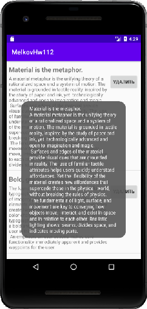

## Задача №2
### Перехват событий на элементах
**Задание**:

Продолжаем работать со списком Sample-ов например из задания или придумать свой набор данных.

- Добавляем каждому элементу списка кнопку “Удалить”. По ее нажатию Sample удаляется из списка.
- В случае длительного нажатия на элемент списка показать Toast с названием примера.
Точно также как в примере лекции заменяем в разметке item_list_view.xml CheckBox на Button c текстом "Удалить" и вешаем на знакомый OnClickListener свой код. В нем мы удаляем наш элемент из списка и обновляем данные адаптера, смотрим еще раз код из лекции. Не забываем notifyDataSetChanged() в адаптере, если он не вызывался внутри установки новых данных.

OnLongClickListener – запускает обработчик долгого нажатия, он очень похож на простой клик (с ним вы знакомы). Единственное, что нужно будет возвращать булеановское значение:

- true — если вы установили на запуск свой код и не хотите, чтобы он дополнительно обрабатывался,
- false — если ничего не обрабатывалось.

